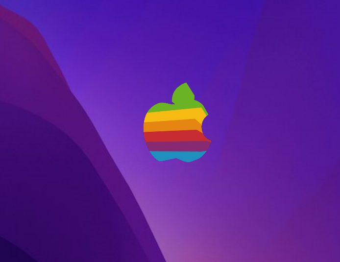

# MacSecretShortcut
Old mac secret shortcut was showing a little robot distroying everything, now its possible on windows (thanks to AutoHotKey). 

- First install [AutoHotKey](https://www.autohotkey.com/)
- create the secret shortcut you want : 
*This one is "Win Shift A":*
`#+A::Run, "/MacSecretShortcut.exe"`

- then install this project in a folder and link the shortcut to the exe file on your computer
- test you shortcut! 

## Preview

